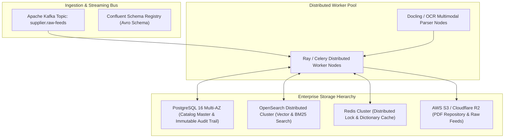

# 🏗️ UniHack Simplifi: Enterprise System Architecture & Working Design

**Author:** Abhishek Vishwakarma  
**Product:** UniHack Simplifi — Industrial Product Intelligence & Evidence-Review Workbench  
**Scope:** Implemented MVP Architecture & Future Enterprise Distributed Scale Roadmap  

---

## 1. Implemented MVP System Architecture

The implemented MVP is architected as a high-performance, verifiable Python 3.12 + FastAPI backend serving an in-memory indexed catalog, connected to an evidence ingestion subsystem and a React 18 TypeScript evidence review workbench:

```mermaid
flowchart TB
    subgraph ClientLayer["🖥️ Frontend: Evidence Review Workbench (React 18 + Vite + Tailwind)"]
        UI_Nav["🧭 3-Domain Navigation (Workspace / Governance / Delivery)"]
        UI_Cat["📋 Catalog Explorer (Keyword & Semantic Search)"]
        UI_Insp["🔍 6-Tab Transformation Inspector (Evidence Above Descriptions)"]
        UI_EvInbox["📥 Live Manufacturer Evidence Inbox (Chunk & Candidate Inspection)"]
        UI_Sand["⚡ Interactive Playground (Fittings Featured Demo Flow)"]
        UI_HITL["🧑‍💼 Field-Level Review Queue (Audit Trail & High-Risk Gate)"]
        UI_Exp["📥 252-Column Delivery Exporter (Formula Injection Sanitized)"]
    end

    subgraph APILayer["🌐 Backend API Layer (FastAPI 0.115+)"]
        GW_Auth["JWT Auth & Role-Based Access Control (Admin / Specialist / Read-Only)"]
        GW_Catalog["Catalog Routes (/api/products, /api/stats)"]
        GW_Evidence["Evidence Registry Routes (/api/evidence/registry, /register, /query)"]
        GW_Review["Field Review Routes (/api/review/field-action, /promote-validated)"]
        GW_RAG["LlamaIndex Hybrid RAG Neural Search (/api/rag/search)"]
        GW_Bench["Validation & Benchmark Routes (/api/benchmark/results)"]
        GW_Export["252-Column CSV / XLSX Exporter (/api/export/csv)"]
    end

    subgraph CoreEngine["⚙️ In-Memory Catalog State & Enrichment Pipeline"]
        S1["1. Sanitizer (Nullify Placeholders & Clean Tokens)"]
        S2["2. Entity Resolver (UniCat Brand & Manufacturer Index)"]
        S3["3. Explainable Taxonomy Engine (Multi-Candidate Ranking)"]
        S4["4. Evidence Attribute Extractor (6-Step Lifecycle)"]
        S5["5. UOM Standardizer (Fraction Formatting & Spacing)"]
        S6["6. Verified-Only Description Generator (INVOICE <=40, MOBILE 60-80)"]
        S7["7. Single Source of Truth Confidence Scorer (Penalty Matrix)"]
        S8["8. 252-Column Delivery Mapper (Formula Sanitization)"]
    end

    subgraph EvidenceStore["🛡️ Official Manufacturer Evidence Subsystem"]
        EvReg["Evidence Registry Manager (data/evidence/source_registry.json)"]
        EvHash["Cryptographic SHA-256 Integrity Verification"]
        EvChunks["Heading & Page Chunking Store (data/evidence/processed/)"]
        EvSearch["In-Memory Lexical & MPN Evidence Search Engine"]
    end

    ClientLayer <--> APILayer
    APILayer <--> CoreEngine
    CoreEngine <--> EvidenceStore
```



---

## 2. Field-Level Provenance & Lineage Model

To eliminate hallucinations and prevent unverified attribute fabrication, every enriched attribute is backed by a structured `EvidenceRecord`:

```python
class EvidenceRecord(BaseModel):
    field_name: str
    candidate_value: Optional[str]
    normalized_value: Optional[str]
    source_url: Optional[str]
    source_type: str  # manufacturer_page | manufacturer_pdf | supplier_input | reference_dictionary | manual_review
    source_title: Optional[str]
    source_page_or_section: Optional[str]
    evidence_excerpt: Optional[str]
    extraction_method: str  # deterministic_rule | document_parser | manual_review
    retrieved_at: str
    confidence: float
    verification_status: str  # verified | candidate | rejected | missing_evidence
    dictionary_identity: Optional[str]
```

### Identity Verification Hierarchy:
1. **Registry Metadata**: When an official source is registered, metadata is stored as **candidate identity** ($C = 0.80$).
2. **Explicit Document Mention**: When ingested chunks explicitly mention the MPN alongside the brand or manufacturer, identity is promoted to **verified** ($C = 0.98$).
3. **UniCat Match**: Canonical casing and trademark symbols are applied as **normalized identity**.

---

## 3. Explainable Taxonomy & Confidence System

### Explainable Multi-Candidate Classification
Rather than returning a single opaque string, the taxonomy engine generates ranked candidate classpaths with complete explanation metadata:
- Top candidate classpaths with scores $[0.0, 1.0]$.
- Exact matching keyword tokens.
- Source evidence (primary token match vs. fallback heuristic).
- Tie-break reasoning when candidate scores are close.
- Automatic routing to the review queue for ambiguous assignments.

### Calibrated Confidence Penalties (`confidence_config.py`)
Confidence is computed field-by-field and rolled up using documented weights:
- **Base Weights**: Brand Identity (25%), Taxonomy (25%), Extracted Attributes (25%), Description Structural Integrity (15%), Completeness (10%).
- **Explicit Penalties**:
  - Missing official manufacturer evidence: $-0.20$
  - Fallback taxonomy classification: $-0.15$
  - Unresolved brand identity: $-0.25$
  - LOV candidate rejection: $-0.10$
  - Ambiguous / conflicting sources: $-0.15$
- **Review Routing**: Any product with composite confidence $< 0.85$ is routed to the Human-in-the-Loop review queue.

---

## 4. Human-in-the-Loop Review & High-Risk Validation Gate

The review queue operates at the granular **field level**:
- Reviewers can perform four actions on flagged fields: `approve`, `edit`, `reject`, or `mark_unknown`.
- Every action creates an immutable `AuditRecord` containing reviewer email, timestamp, prior value, new value, action type, and rationale.
- **High-Risk Field Gate**: A product cannot be promoted to `Validated` status while high-risk fields (`brand_name`, `mfg_part_number`, `classpath`) remain unresolved.
- **Unknown as a Success State**: Fields marked as unknown or lacking evidence remain intentionally blank in the 252-column export, ensuring zero fabricated claims.

---

## 5. Future Production Scale Roadmap (10M+ SKUs)

*Note: The following architecture describes the planned production distributed scale roadmap beyond the current standalone MVP.*



### Scale Targets for Future Production:
- **Throughput**: Distributed processing of 100,000 SKUs in $< 15$ minutes across 32 Ray worker nodes.
- **Storage**: Tiered storage using AWS S3 / Cloudflare R2 for immutable raw manufacturer PDFs.
- **Search**: OpenSearch cluster for distributed hybrid dense-sparse neural search over 10M+ industrial items.
