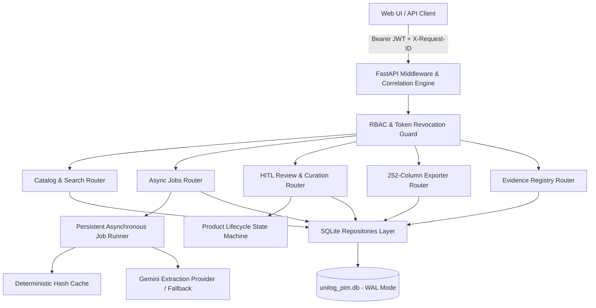
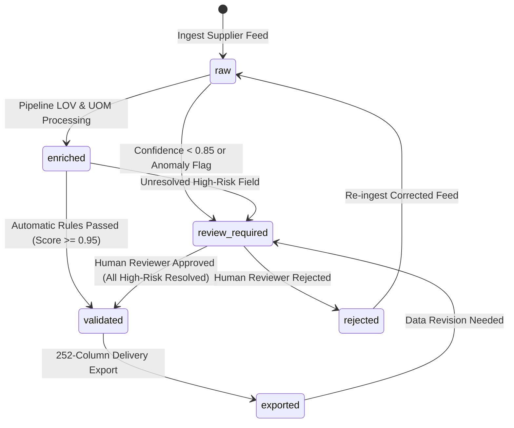
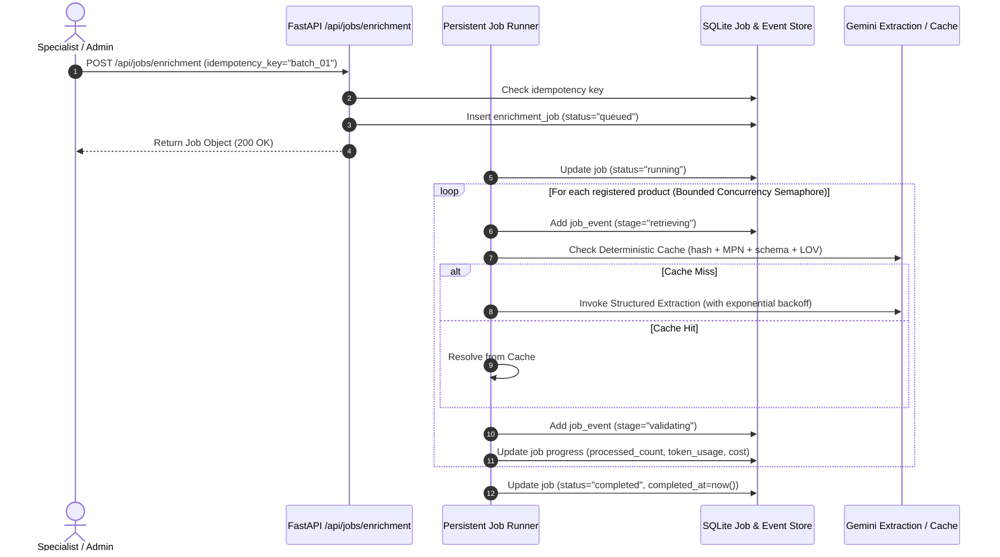

# UniHack Simplifi PIM — Robust Backend Architecture

## Overview
The UniHack Simplifi PIM backend is an enterprise-grade, evidence-first Product Information Management (PIM) and enrichment engine. It couples deterministic extraction pipelines and LOV/UOM validators with persistent SQLite storage (WAL mode), asynchronous background job execution, and strict role-based access control (RBAC).

---

## 1. Architectural Principles
1. **Never Fabricate Facts**: AI output is strictly candidate data; unsupported attributes remain blank in the 252-column export format.
2. **Deterministic Precedence**: Source chunks from registered official manufacturer documents override raw supplier text; human review actions permanently audit every write.
3. **Repository Abstraction**: All database queries are isolated behind domain repository interfaces (`UserRepository`, `ProductRepository`, `EvidenceRepository`, `ReviewRepository`, `JobRepository`, `AuditRepository`, `BenchmarkRepository`, `ExportRepository`), allowing zero-friction migration to PostgreSQL or Cloud SQL.
4. **Idempotent Background Jobs**: Bounded concurrent workers with exponential backoff for transient failures, granular per-product state events, and persistent recovery across server restarts.
5. **Defense-in-Depth Security**: SSRF & DNS rebinding protections, RFC 1918 private IP blockers, domain allowlists, token revocation versioning, and CSV formula injection neutralization.

---

## 2. System Component Diagram

---

## 3. Database Schema & Tables

The database engine runs SQLite with `PRAGMA journal_mode=WAL` and `PRAGMA foreign_keys=ON`.

| Table | Purpose | Key Columns / Indexes |
|---|---|---|
| `users` | User accounts, credentials, RBAC roles, token versioning | `id` (PK), `email` (UNIQUE), `role`, `token_version` |
| `products` | Core catalog products and lifecycle status | `id` (PK), `mfg_part_num`, `status`, `confidence`, `brand`, `manufacturer` |
| `raw_supplier_inputs` | Immutable snapshot of raw distributor input feed | `product_id` (FK), `raw_part_desc`, `raw_mfg_part_num`, `row_id` |
| `enriched_fields` | Normalized field values and source citations | `product_id` (FK), `field_name`, `normalized_value`, `confidence` |
| `field_evidence` | Traceable evidence excerpts aligned to source text | `id` (PK), `field_id` (FK), `source_id` (FK), `quote`, `char_start` |
| `source_registry` | Allowlisted manufacturer documents & hashes | `source_id` (PK), `file_hash`, `url`, `mpn`, `chunks_count`, `status` |
| `review_actions` | Human curation decisions (approve, edit, reject) | `id` (PK), `product_id` (FK), `field_name`, `action`, `reviewer` |
| `audit_logs` | Append-only immutable system audit log | `id` (PK), `user_email`, `role`, `action`, `entity_type`, `timestamp` |
| `enrichment_jobs` | Background batch execution metadata & token stats | `job_id` (PK), `status`, `processed_products`, `token_usage`, `idempotency_key` |
| `job_events` | Granular per-product lifecycle event stream | `id` (PK), `job_id` (FK), `mpn`, `stage`, `message`, `timestamp` |
| `benchmark_runs` | Ground truth accuracy and character-gate history | `run_id` (PK), `overall_score`, `metrics`, `created_at` |
| `export_history` | 252-column export audit and SHA-256 checksums | `id` (PK), `user_email`, `product_count`, `checksum_sha256` |

---

## 4. Product Lifecycle State Machine

---

## 5. Persistent Asynchronous Job Pipeline

